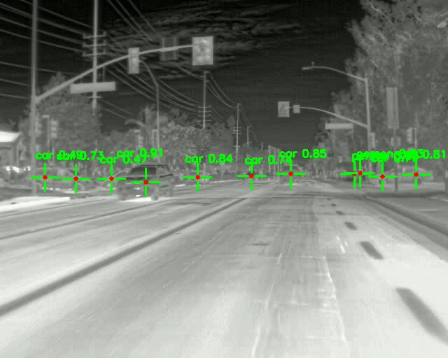

# Thermal Object Detection with Custom Crosshairs (YOLOv8)

This project uses a custom-trained YOLOv8 model to detect specific targets in thermal video footage. Instead of drawing standard bounding boxes, the script calculates the center of each detected object and draws a military-style crosshair over the targets.

## Features
* **Thermal Image Tracking:** Utilizes a custom YOLOv8 model (`best.pt`) specifically trained on thermal imagery.
* **Custom Crosshairs:** Replaces traditional bounding boxes with a custom targeting reticle (red center dot with green cross lines).
* **Confidence Filtering:** Automatically ignores detections with a confidence score below 40% to prevent false positives.
* **Video Export:** Processes the video frame-by-frame and saves the output as a new `.mp4` file.

## Requirements

You need Python installed along with the following libraries:

```bash
pip install opencv-python ultralytics